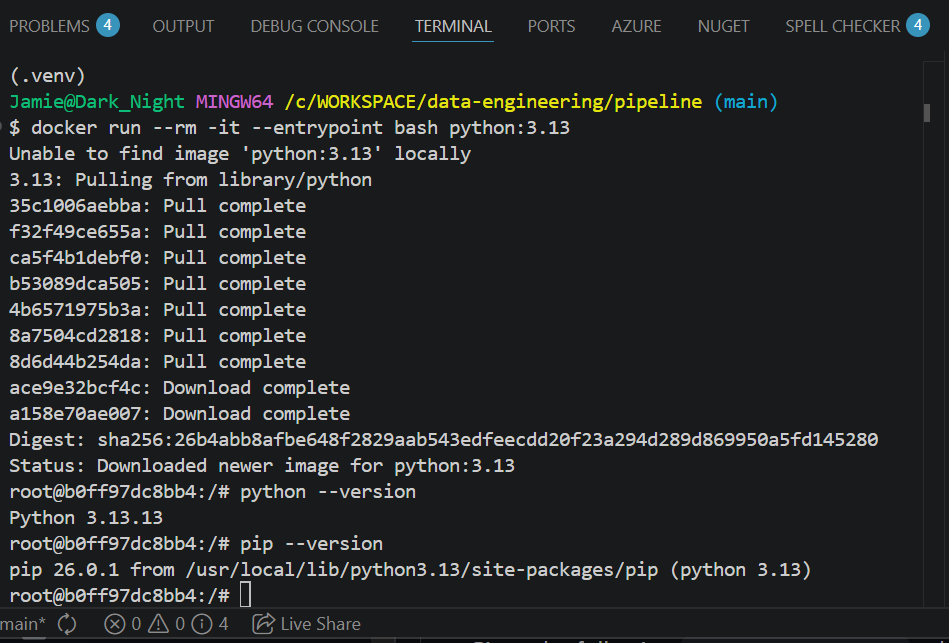

# Homework

## Question 1. Understanding Docker Images

Run Docker with the `python:3.13` image and use a Bash entrypoint to interact with the container.

1. Start the container with an interactive shell.

	```bash
	docker run --rm -it --entrypoint bash python:3.13
	```

2. Check the `pip` version inside the container.

	```bash
	pip --version
	```

### Result

What is the `pip` version in the image?



## Question 2. Understanding Docker Networking and Docker Compose

Given the following `docker-compose.yaml`, what hostname and port should `pgadmin` use to connect to the `postgres` database?

```yaml
services:
  db:
    container_name: postgres
    image: postgres:17-alpine
    environment:
      POSTGRES_USER: 'postgres'
      POSTGRES_PASSWORD: 'postgres'
      POSTGRES_DB: 'ny_taxi'
    ports:
      - '5433:5432'
    volumes:
      - vol-pgdata:/var/lib/postgresql/data

  pgadmin:
    container_name: pgadmin
    image: dpage/pgadmin4:latest
    environment:
      PGADMIN_DEFAULT_EMAIL: "pgadmin@pgadmin.com"
      PGADMIN_DEFAULT_PASSWORD: "pgadmin"
    ports:
      - "8080:80"
    volumes:
      - vol-pgadmin_data:/var/lib/pgadmin

volumes:
  vol-pgdata:
    name: vol-pgdata
  vol-pgadmin_data:
    name: vol-pgadmin_data
```

### Result

Hostname: postgres

Port: 5432


