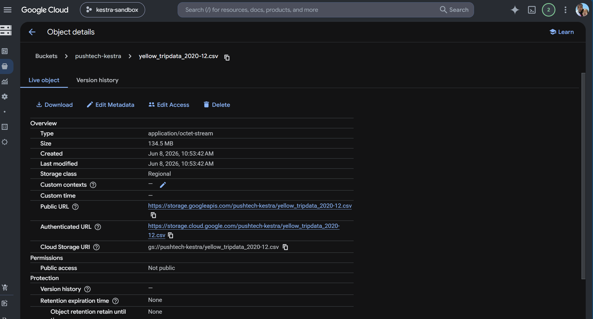
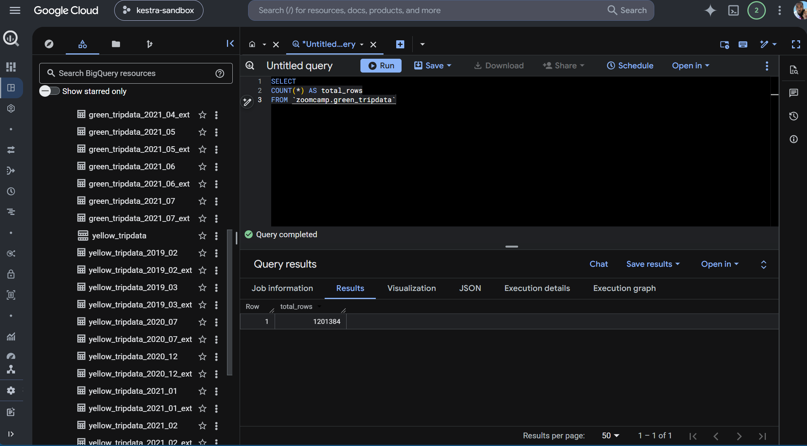
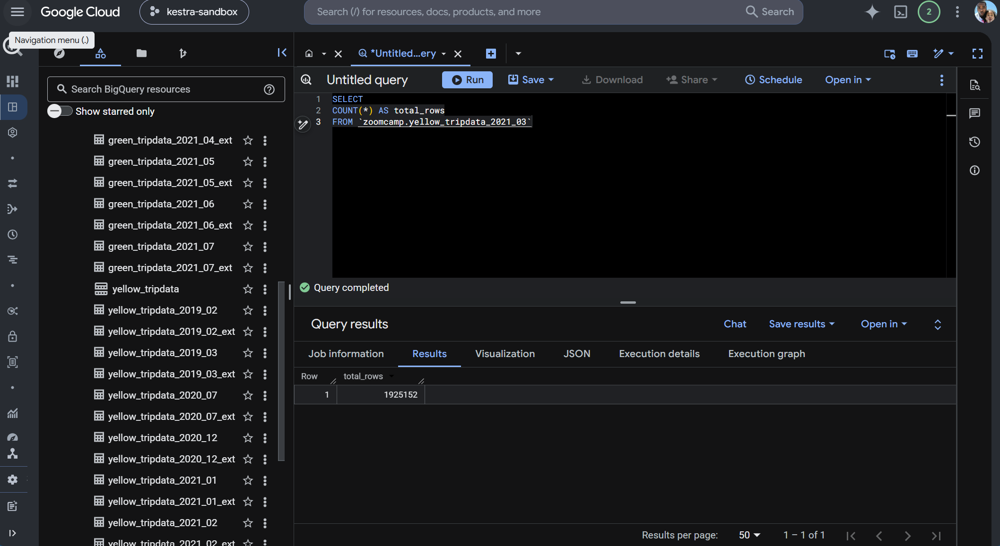

# Homework

## Question 1. Uncompressed File Size

Within the execution for Yellow Taxi data for year 2020 and month 12, what is the uncompressed file size (the output file yellow_tripdata_2020-12.csv from the extract task)?

### Result

```text
134.5 MiB
```



## Question 2. Rendered file Variable

What is the rendered value of variable file when inputs are taxi=green, year=2020, and month=04?

Template:

```text
{{inputs.taxi}}_tripdata_{{inputs.year}}-{{inputs.month}}.csv
```

### Result

```text
green_tripdata_2020-04.csv
```

## Question 3. Yellow Taxi Rows in 2020

How many rows are there for Yellow Taxi data across all CSV files in year 2020?

### Result


## Question 4. Green Taxi Rows in 2020

How many rows are there for Green Taxi data across all CSV files in year 2020?

### Result



## Question 5. Yellow Taxi Rows in March 2021

How many rows are there for Yellow Taxi data in March 2021?

### Result



## Question 6. Schedule Trigger Timezone

How would you configure the timezone to New York in a Schedule trigger?

### Result

```text
Add a timezone property set to America/New_York in the Schedule trigger configuration.
```