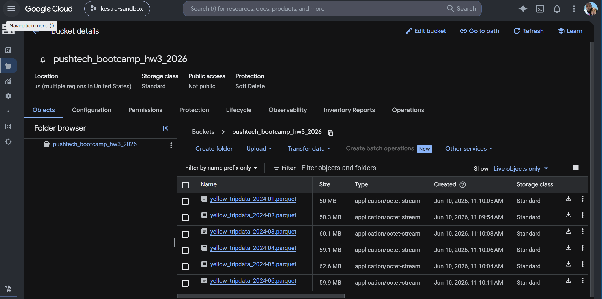
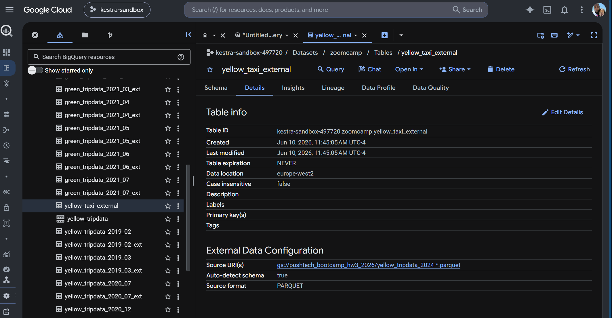
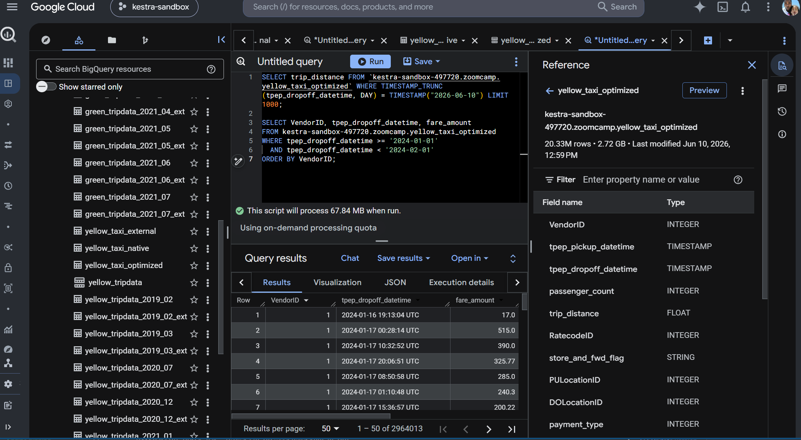

# Homework


## Question 1. Counting Records

What is the count of records for the 2024 Yellow Taxi Data?

### Result

```text
20,332,093
```

## Question 2. Data Read Estimation



Write a query to count the distinct number of PULocationIDs for the entire dataset on both the external table and the materialized table.

What is the estimated amount of data that will be read when this query is executed on each table?

### Result

```text
2.14 GB for the External Table and 0 MB for the Materialized Table
```

## Question 3. Understanding Columnar Storage

Write a query to retrieve the PULocationID from the materialized table. Then write a query to retrieve both PULocationID and DOLocationID from the same table.

Why are the estimated number of bytes different?

### Result

```text
BigQuery is a columnar database and only scans the specific columns requested.
Querying two columns (PULocationID, DOLocationID) requires reading more data
than querying one column (PULocationID), resulting in a higher estimated bytes processed.
```

## Question 4. Counting Zero Fare Trips

How many records have a fare_amount of 0?

### Result

```text
8,333
```

## Question 5. Partitioning and Clustering

What is the best strategy to make an optimized table in BigQuery if your query will always filter on tpep_dropoff_datetime and order results by VendorID?

### Result

```text
Partition by tpep_dropoff_datetime and Cluster on VendorID
```



## Question 6. Partition Benefits

Write a query to retrieve the distinct VendorIDs where tpep_dropoff_datetime is between 2024-03-01 and 2024-03-15 (inclusive).

Run the query against the materialized table and again against the partitioned table. What are the estimated bytes processed for each?

### Result

```text
310.24 MB for the non-partitioned table and 26.84 MB for the partitioned table
```

## Question 7. External Table Storage

Where is the data stored in the External Table you created?

### Result

```text
Two places:
A. The raw data remains entirely inside your original, external data store (GCS).
B. The table schema and definition is stored in BigQuery.
```

## Question 8. Clustering Best Practices

Is it best practice in BigQuery to always cluster your data?

### Result

```text
False
```